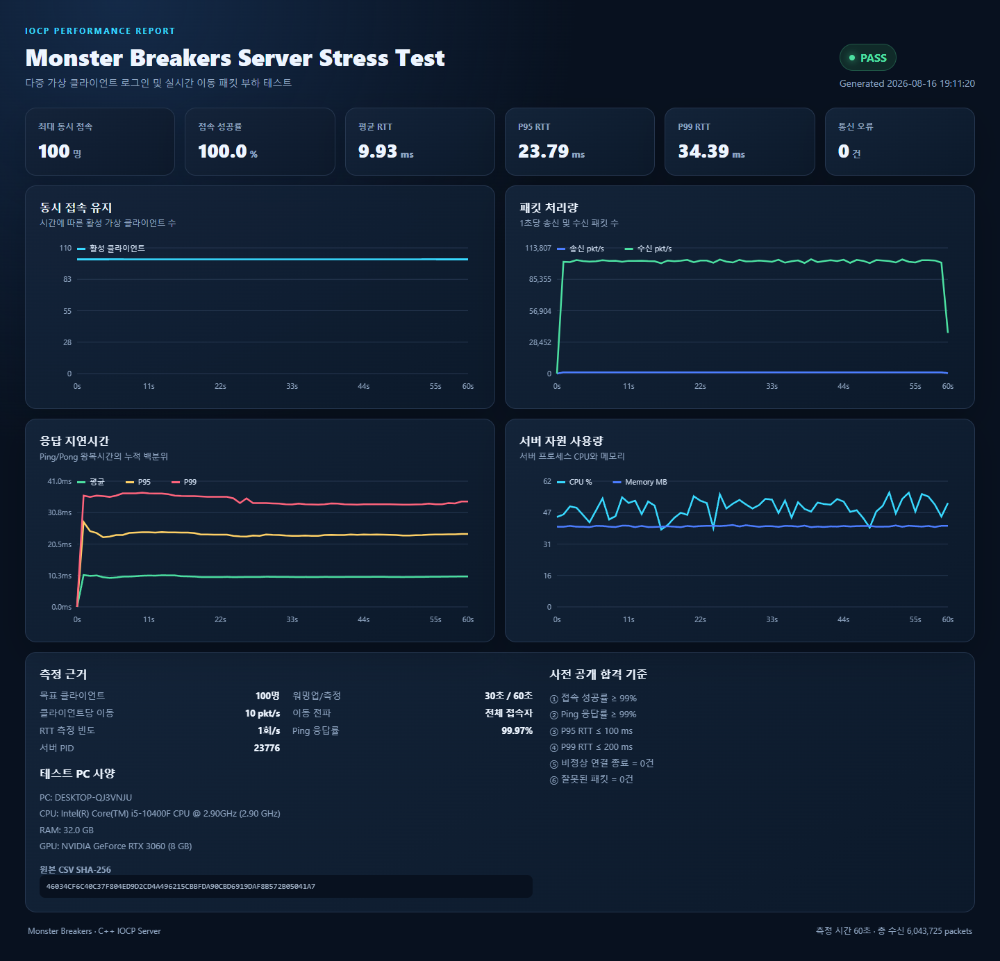
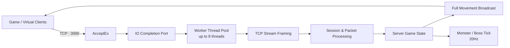

# Monster Breakers IOCP Server

> Windows IOCP 기반 멀티플레이 게임 서버입니다. 비동기 접속·송수신, 세션 수명 관리, 게임 상태 동기화와 몬스터/보스 로직을 구현하고, 별도의 가상 클라이언트 부하 테스트로 처리 성능을 검증했습니다.

## 핵심 성능 결과

**100명의 플레이어가 초당 10회 이동하고, 각 이동을 나머지 접속자 전원에게 동기화하는 조건**에서 측정했습니다.

| 항목 | 결과 |
|---|---:|
| 최대 동시 접속 | **100명** |
| 접속 성공률 | **100.0%** |
| Ping 응답률 | **99.97%** |
| 평균 RTT | **9.93ms** |
| P95 / P99 RTT | **23.79ms / 34.39ms** |
| 가상 클라이언트 수신 처리량 | **평균 약 100,729 packets/s** |
| 서버 CPU | **평균 48.88% / 최대 56.37%** |
| 서버 메모리 | **평균 39.74MB / 최대 40.39MB** |
| 비정상 종료 / 잘못된 패킷 | **0건 / 0건** |

[상세 HTML 리포트](docs/benchmarks/stress-test-100.html) · [원본 CSV](docs/benchmarks/stress-test-100.csv)



## 담당 및 구현

### IOCP 네트워크 서버

- `AcceptEx`와 IOCP Completion Port를 이용한 비동기 접속 처리
- 하드웨어 동시 실행 수에 따라 최대 8개의 Worker Thread 운용
- Overlapped I/O 기반 비동기 `WSARecv` / `WSASend`
- 접속, 수신, 송신 완료를 하나의 IOCP Worker 흐름에서 처리

### 패킷과 세션 관리

- TCP 스트림의 패킷 분할·병합을 고려한 패킷 프레이밍
- 로그인, 입장/퇴장, 이동, 스킬, 피격, 버프, 리스폰 패킷 처리
- `LoadingDone` 이전 이동을 차단해 서버 기준 스폰 위치와 클라이언트 상태 일치
- 세션 검색·종료와 게임 틱이 동시에 실행될 때 발생할 수 있는 수명 경쟁 조건 보호
- 대량 접속 종료 시 중복 종료 및 예상 가능한 소켓 종료 오류 처리

### 게임 상태 동기화

- 플레이어의 위치, 방향, 애니메이션 상태를 서버에서 갱신
- 이동 패킷을 송신자를 제외한 **전체 접속자에게 전파**
- 몬스터와 보스 AI를 서버 20Hz 고정 틱으로 처리
- 몬스터 스폰·이동·피격·사망, 보스 패턴, 골드 보상과 리스폰 동기화

### 성능 검증 도구

- IOCP 기반 가상 클라이언트로 실제 로그인 → `LoadingDone` → 이동 흐름 재현
- Ramp-up, Warm-up, 측정 시간, 이동/Ping 빈도를 명령행에서 설정
- 실제 Ping/Pong으로 평균·P50·P95·P99 RTT 측정
- 서버 프로세스 CPU·메모리, 접속률, 오류, 패킷 처리량을 1초 단위 CSV로 기록
- 사전 합격 기준과 원본 CSV SHA-256을 포함한 HTML 대시보드 자동 생성
- 동일 조건 반복 실행과 Run별 결과 비교 리포트 지원

## 서버 처리 흐름



## 해결한 주요 문제

| 문제 | 원인 | 해결 |
|---|---|---|
| 18바이트 패킷을 잘못된 크기로 판단 | TCP에서 패킷 헤더나 본문이 나뉘어 도착할 수 있음 | 불완전한 데이터는 다음 수신까지 보존하고, 완성된 패킷만 처리하도록 스트림 파서 수정 |
| 대량 종료 시 `10053` 송신 오류와 서버 불안정 | 종료 중인 세션에 비동기 송신이 겹치고 세션 포인터의 수명이 경쟁함 | 세션을 종료 예정 상태로 전환한 뒤 맵에서 제거하고, 수신/게임 틱과 삭제 구간을 수명 잠금으로 보호 |
| 로그인 직후 이동 위치 불일치 | 클라이언트 로딩 완료 전에 이동 패킷이 처리됨 | `LoadingDone`을 기준으로 게임 준비 상태를 전환하고 준비 전 이동은 무시 |
| 높은 접속 수에서는 연결되지만 RTT가 계속 증가 | 전원 동기화가 `N × (N-1)`로 증가해 송신 대기열이 누적됨 | 인원·이동 빈도를 단계적으로 올려 한계를 측정하고, 임의로 동기화 대상을 줄이지 않은 100명 결과를 공식 지표로 선정 |

## 스트레스 테스트 조건

| 구분 | 설정 |
|---|---|
| 서버/부하 발생기 | 동일 PC, `127.0.0.1` TCP 루프백 |
| 가상 클라이언트 | 100명 |
| 접속 Ramp-up | 20초 |
| Warm-up / 측정 | 30초 / 60초 |
| 이동 빈도 | 클라이언트당 10 packets/s |
| 이동 전파 | 송신자를 제외한 전체 접속자 |
| RTT 측정 | 클라이언트당 1회/s |
| 테스트 PC | Intel i5-10400F, RAM 32GB, NVIDIA RTX 3060 8GB |

사전 합격 기준은 접속 성공률 99% 이상, Ping 응답률 99% 이상, P95 RTT 100ms 이하, P99 RTT 200ms 이하, 비정상 종료 및 잘못된 패킷 0건으로 설정했습니다.

> 이 수치는 같은 PC의 TCP 루프백 환경에서 측정한 서버 애플리케이션 처리 지표입니다. 공용 인터넷의 물리적 네트워크 지연을 포함하지 않으며, 위 대표 결과는 Warm-up 이후 60초간 측정한 1회 결과입니다.

## 실행 및 재현

### 서버 빌드

Visual Studio 2022에서 아래 솔루션을 열고 `Release | x64`로 빌드합니다.

```text
Monster_Breakers_Server/Monster_Breakers_Server.sln
```

빌드 후 서버 실행 파일:

```text
Monster_Breakers_Server/x64/Release/Monster_Breakers_Server.exe
```

### 대표 스트레스 테스트

서버를 먼저 실행한 다음 `StressTest` 폴더에서 실행합니다.

```powershell
powershell -ExecutionPolicy Bypass -File ".\run_test.ps1" -Clients 100 -Ramp 20 -Warmup 30 -Duration 60 -MoveHz 10 -PingHz 1 -OpenReport
```

### 반복 벤치마크

```powershell
powershell -ExecutionPolicy Bypass -File ".\run_benchmark.ps1" -Clients 100 -Ramp 20 -Warmup 30 -Duration 180 -MoveHz 10 -PingHz 1 -Runs 3 -OpenReport
```

## 프로젝트 구성

```text
Monster_Breakers_IOCP/
├─ Monster_Breakers_Server/   # IOCP 게임 서버, 프로토콜, 몬스터/보스 로직
├─ StressTest/                # 가상 클라이언트, 실행 스크립트, 리포트 생성기
└─ docs/
   ├─ benchmarks/             # 포트폴리오용 HTML 리포트와 원본 CSV
   └─ images/                 # README 결과 이미지
```

## 기술 스택

- C++ / WinSock2 / Windows IOCP / Overlapped I/O
- TCP Binary Protocol
- Multi-threading, `mutex`, `shared_mutex`, atomic
- PowerShell, HTML, JavaScript 기반 성능 리포트
- Visual Studio 2022, x64 Release
